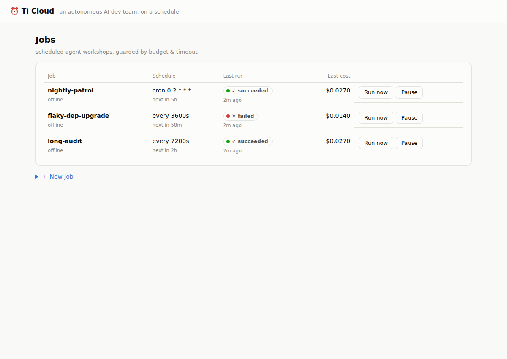
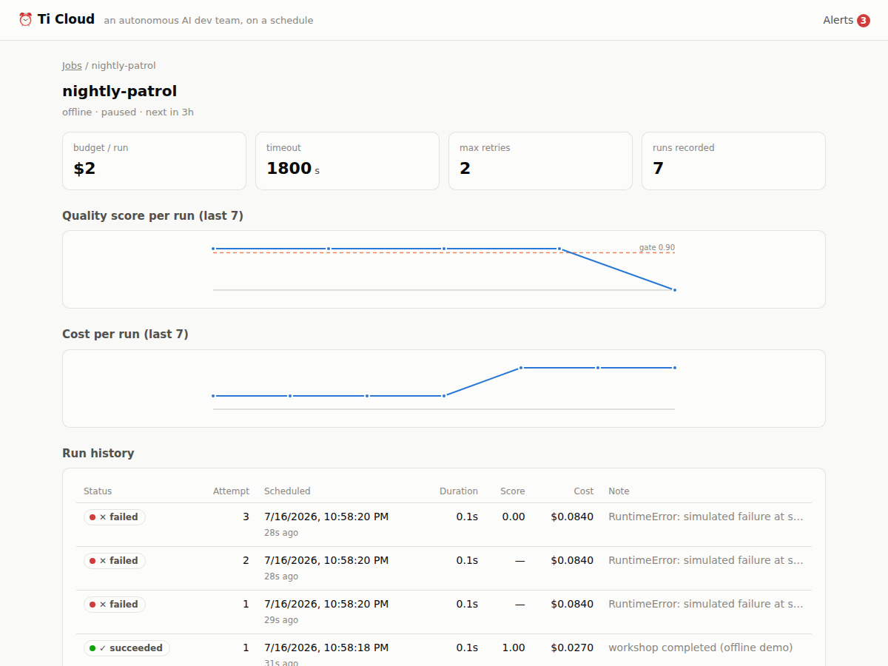
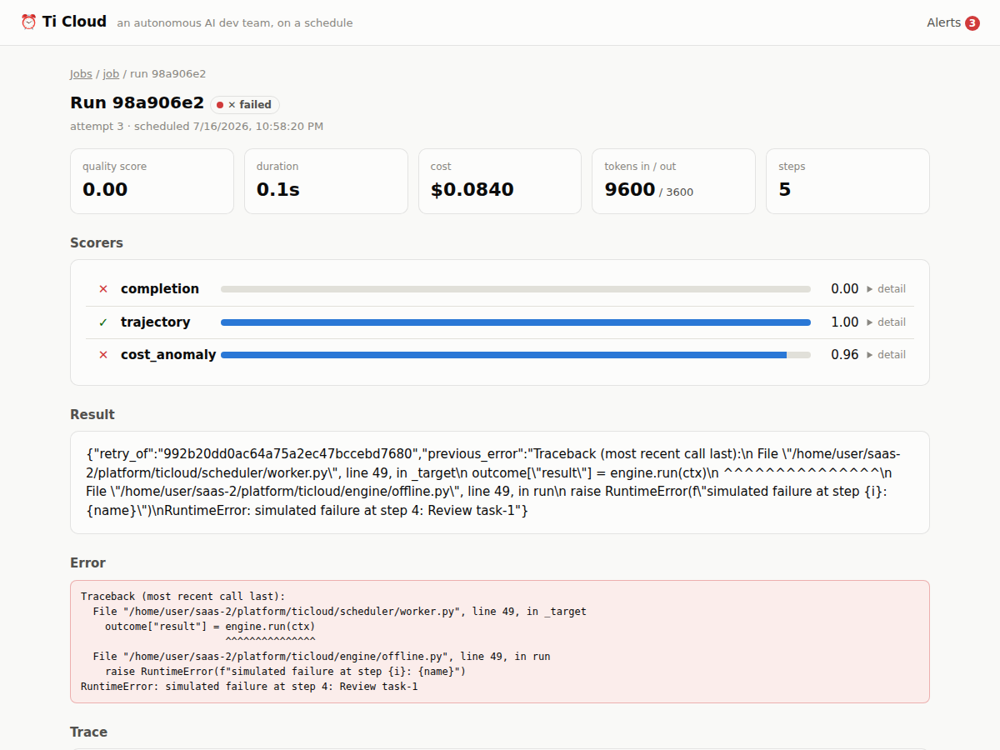
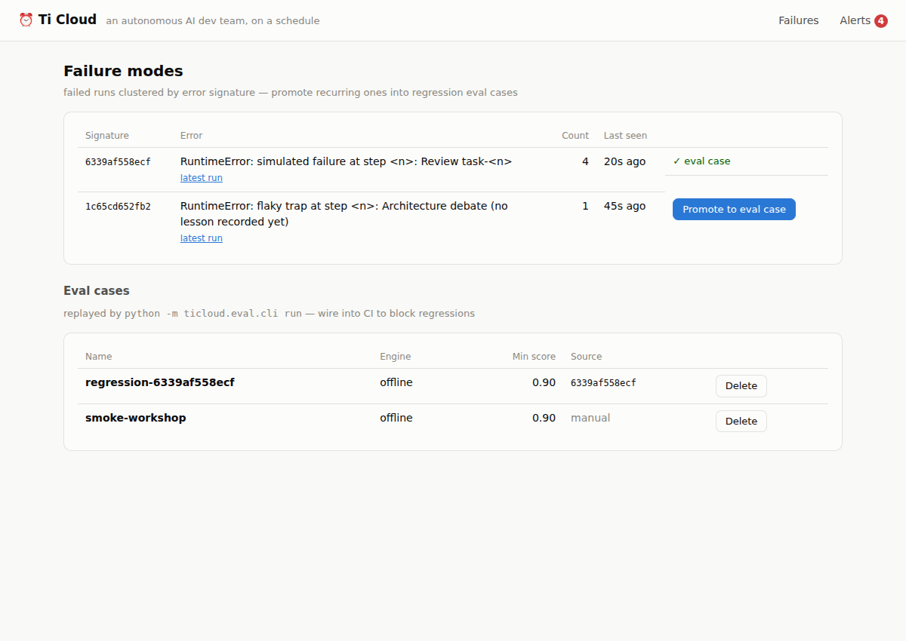

# Ti Cloud

**An autonomous AI dev team on a schedule** — it patrols your repos, ships
quality-gated PRs, and never forgets what it learned.

## Why

The most valuable agents aren't chatbots — they're the **unattended** ones:
nightly repo patrols, recurring dependency upgrades, CI babysitters. And
they have a structural problem: *nobody watches each run*. A chat agent
that breaks gets caught by its user in seconds; a cron agent that breaks
fails silently for weeks. Industry surveys put observability adoption at
~89% of teams running agents in production, but rigorous evals at only
~52% — most failures live in that gap.

Existing tools each cover half the problem:

- **Schedulers** (Temporal, Inngest, cron) run things reliably but don't
  understand agents — no token budgets, no trajectory quality, no notion
  of "the output got worse."
- **LLM observability** (Langfuse, LangSmith) shows you traces but doesn't
  own the schedule, and won't stop a degraded agent from running again
  tomorrow night.

Ti Cloud is the missing composition: **agent-native scheduling with an
automated quality loop** —

```
schedule → run → score every run → gate (alert / auto-pause)
   ↑                                        │
   └── lessons + regression eval cases ←────┘
```



## What it does

- **Agent-native cron/loop scheduling** — cron or interval triggers with
  per-run **cost budgets**, **timeouts**, and **failure-context retries**
  (a retry carries the previous error so the next attempt can adapt).
- **Structured run traces** — every role turn and tool call recorded live
  (role, cost, tokens, timing), streamable to the built-in dashboard.
- **Quality gates** — every finished run is scored automatically:
  rule-based scorers (completion, **trajectory health** — stuck-loop and
  review-verdict checks that catch "answer looked fine, process was broken"
  silent failures — and cost anomaly vs the job's own history) plus an
  optional Claude **LLM judge** (`pip install "platform[judge]"` +
  `ANTHROPIC_API_KEY`). Score below the job's `score_threshold` → alert
  (webhook via `TICLOUD_WEBHOOK_URL`, Slack-compatible) and, with
  `on_low_score: "pause"`, the schedule **auto-pauses**.
- **Drift view** — score and cost trends per job with the gate drawn in,
  so slow degradation is visible before it becomes an incident.
- **Knowledge flywheel** — failures become knowledge, automatically:
  - **Lessons**: every failure is recorded as a per-job lesson (deduped by
    failure signature); engines read lessons before starting, so a retry —
    and every later run — avoids the trap it already hit.
  - **Failure modes**: failed runs cluster by normalized error signature
    (no embedding API needed); one click promotes a recurring mode into a
    regression **eval case**.
  - **Eval CLI / CI gate**: `python -m ticloud.eval.cli run` replays the
    eval-set through the real engine + scorers and exits non-zero on any
    case below its `min_score` — wire it into CI
    (`.github/workflows/eval-gate.yml`) and a failure mode stays red until
    it's actually fixed.

| Drift view (gate drawn in) | Scorer breakdown per run |
|---|---|
|  |  |



## Quick start (no API keys required)

```bash
# Full stack (Postgres + API + worker):
docker compose -f deploy/docker-compose.yml up

# Or local dev (SQLite, zero config):
pip install -e "platform[dev]"
uvicorn ticloud.api.main:app --reload &        # API + dashboard on :8000/ui/
python -m ticloud.scheduler.worker &           # scheduler + executor
python -m ticloud.demo                         # seed the showcase jobs
```

Open **http://localhost:8000/ui/**. The demo seed exercises everything
with the built-in offline engine (a simulated multi-expert workshop —
PM → engineers → QA — no credentials needed):

- `nightly-patrol` failed once, **recorded a lesson, and succeeded on the
  retry** — open its latest run to see "lessons applied".
- `dep-upgrade` kept failing — the quality gate scored it 0, raised
  alerts, and **auto-paused the schedule**; its failures are clustered
  under **Failures**, one click away from becoming a regression eval case.
- `long-audit` shows the live step-by-step trace.

Create your own job:

```bash
curl -X POST localhost:8000/jobs -H 'content-type: application/json' -d '{
  "name": "my-patrol",
  "engine": "offline",
  "cron": "0 2 * * *",
  "budget_usd": 2.0,
  "score_threshold": 0.8,
  "on_low_score": "pause"
}'
```

## Running the flagship Ti engine

The Ti adapter drives a real [Ti](https://github.com/x812033727/Ti)
multi-expert workshop (PM / engineer / senior / QA collaborating on a real
repo) as a scheduled job. Point the platform at a Ti checkout and give the
job a repo and a brief:

```bash
export TICLOUD_TI_PATH=/path/to/Ti   # a checkout with its own .venv

curl -X POST localhost:8000/jobs -H 'content-type: application/json' -d '{
  "name": "nightly-repo-patrol",
  "engine": "ti",
  "cron": "30 3 * * *",
  "timeout_s": 5400,
  "budget_usd": 5.0,
  "score_threshold": 0.6,
  "payload": {
    "repo_url": "https://github.com/you/your-repo",
    "publish_repo": "you/your-repo",
    "brief": "Patrol the repo: find one worthwhile bug or improvement, fix it with tests, and open a PR."
  }
}'
```

The workshop runs headlessly in a subprocess using Ti's own interpreter
(dependencies stay isolated), streams its stages, critic verdicts, and
token/cost usage into the run trace, and reports the PR it opened in the
run result. Budget, timeout, retry-with-failure-context, scoring, and the
knowledge flywheel (job lessons are folded into the workshop brief; every
failure becomes a lesson) all apply — same as any other engine.

## Layout

```
platform/ticloud/
  scheduler/   cron computation, DB-backed queue (SKIP LOCKED), worker loop
  engine/      AgentEngine protocol, offline demo engine, Ti adapter
  eval/        scorers (rules + LLM judge), failure clustering, eval CLI
  api/         FastAPI management API (jobs, runs, alerts, eval cases)
  web/         no-build dashboard (jobs, drift, trace, failures) at /ui/
  demo.py      one-command showcase seed
deploy/        Dockerfile + docker-compose (Postgres + API + worker)
docs/PLAN.md   product plan & roadmap (zh-TW); docs/LAUNCH.md launch notes
```

## Tests

```bash
cd platform && python -m pytest      # 55 tests
python -m ticloud.eval.cli run       # eval-set regression gate
```

## Roadmap

- **Semantic failure clustering** — embedding-based grouping on top of the
  deterministic signatures (cloud tier).
- **Multi-tenancy + hosted cloud** — managed schedules, team workspaces,
  SSO; join the waitlist by opening an issue.

## License

Apache-2.0 — see [LICENSE](LICENSE). The platform core is and stays open
source; a hosted cloud version funds development.
