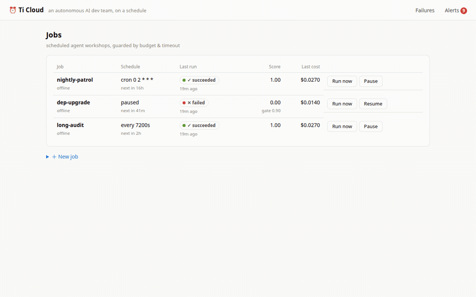

# Ti Cloud

[](https://github.com/x812033727/saas-2/actions/workflows/ci.yml)
[](https://github.com/x812033727/saas-2/actions/workflows/eval-gate.yml)
[](LICENSE)

**An autonomous AI dev team on a schedule** — it patrols your repos, ships
quality-gated PRs, and never forgets what it learned.



## Why

The most valuable agents aren't chatbots — they're the **unattended** ones:
nightly repo patrols, recurring dependency upgrades, CI babysitters. And
they have a structural problem: *nobody watches each run*. A chat agent
that breaks gets caught by its user in seconds; a cron agent that breaks
fails silently for weeks. Industry surveys put observability adoption at
~89% of teams running agents in production, but rigorous evals at only
~52% — most failures live in that gap.

Existing tools each cover half the problem:

- **Schedulers** (Temporal, Inngest, cron) run things reliably but don't
  understand agents — no token budgets, no trajectory quality, no notion
  of "the output got worse."
- **LLM observability** (Langfuse, LangSmith) shows you traces but doesn't
  own the schedule, and won't stop a degraded agent from running again
  tomorrow night.

Ti Cloud is the missing composition: **agent-native scheduling with an
automated quality loop** —

```
schedule → run → score every run → gate (alert / auto-pause)
   ↑                                        │
   └── lessons + regression eval cases ←────┘
```


## What it does

- **Agent-native cron/loop scheduling** — cron or interval triggers with
  per-run **cost budgets**, **timeouts**, and **failure-context retries**
  (a retry carries the previous error so the next attempt can adapt).
- **Structured run traces** — every role turn and tool call recorded live
  (role, cost, tokens, timing), streamable to the built-in dashboard.
- **Quality gates** — every finished run is scored automatically:
  rule-based scorers (completion, **trajectory health** — stuck-loop and
  review-verdict checks that catch "answer looked fine, process was broken"
  silent failures — and cost anomaly vs the job's own history) plus an
  optional Claude **LLM judge** (`pip install "platform[judge]"` +
  `ANTHROPIC_API_KEY`). Score below the job's `score_threshold` → alert
  (webhook via `TICLOUD_WEBHOOK_URL`, Slack-compatible) and, with
  `on_low_score: "pause"`, the schedule **auto-pauses**.
- **Drift view** — score and cost trends per job with the gate drawn in,
  so slow degradation is visible before it becomes an incident.
- **Knowledge flywheel** — failures become knowledge, automatically:
  - **Lessons**: every failure is recorded as a per-job lesson (deduped by
    failure signature); engines read lessons before starting, so a retry —
    and every later run — avoids the trap it already hit.
  - **Failure modes**: failed runs cluster by normalized error signature
    (no embedding API needed); one click promotes a recurring mode into a
    regression **eval case**.
  - **Eval CLI / CI gate**: `python -m ticloud.eval.cli run` replays the
    eval-set through the real engine + scorers and exits non-zero on any
    case below its `min_score` — wire it into CI
    (`.github/workflows/eval-gate.yml`) and a failure mode stays red until
    it's actually fixed. Other repos add it in one step with the composite
    action: `uses: x812033727/saas-2@main` with a `database-url` input.

| Drift view (gate drawn in) | Scorer breakdown per run |
|---|---|
|  |  |


## Quick start (no API keys required)

```bash
# Full stack (Postgres + API + worker):
docker compose -f deploy/docker-compose.yml up

# Or local dev (SQLite, zero config):
pip install -e "platform[dev]"
uvicorn ticloud.api.main:app --reload &        # API + dashboard on :8000/ui/
python -m ticloud.scheduler.worker &           # scheduler + executor
python -m ticloud.demo                         # seed the showcase jobs
```

Open **http://localhost:8000/ui/**. The demo seed exercises everything
with the built-in offline engine (a simulated multi-expert workshop —
PM → engineers → QA — no credentials needed):

- `nightly-patrol` failed once, **recorded a lesson, and succeeded on the
  retry** — open its latest run to see "lessons applied".
- `dep-upgrade` kept failing — the quality gate scored it 0, raised
  alerts, and **auto-paused the schedule**; its failures are clustered
  under **Failures**, one click away from becoming a regression eval case.
- `long-audit` shows the live step-by-step trace.

Create your own job:

```bash
curl -X POST localhost:8000/jobs -H 'content-type: application/json' -d '{
  "name": "my-patrol",
  "engine": "offline",
  "cron": "0 2 * * *",
  "budget_usd": 2.0,
  "score_threshold": 0.8,
  "on_low_score": "pause"
}'
```

## Job templates

`GET /templates` lists ready-made presets; `POST /jobs/from-template/{id}`
creates a job from one, merging your name + payload (e.g. the repo URL):

```bash
curl -X POST localhost:8000/jobs/from-template/nightly-repo-patrol \
  -H 'content-type: application/json' \
  -d '{"name": "patrol-my-repo", "payload": {"repo_url": "https://github.com/you/repo"}}'
```

Flagship templates: `nightly-repo-patrol`, `dependency-upgrade`,
`ci-babysitter` (all Ti-engine, open PRs against your repo), plus
`demo-workshop` (offline, zero setup).

## Human-approval gate

Set `approval_required: true` on a job and **no run executes until a human
approves it** — the trust gate for unattended agents. Each triggered/
scheduled run parks in `awaiting_approval` and raises an
`approval_required` alert; `GET /approvals` is the queue.
`POST /runs/{id}/approve` re-queues it to run; `POST /runs/{id}/reject`
terminates it without ever running the engine.

## Running the flagship Ti engine

The Ti adapter drives a real [Ti](https://github.com/x812033727/Ti)
multi-expert workshop (PM / engineer / senior / QA collaborating on a real
repo) as a scheduled job. Point the platform at a Ti checkout and give the
job a repo and a brief:

```bash
export TICLOUD_TI_PATH=/path/to/Ti   # a checkout with its own .venv

curl -X POST localhost:8000/jobs -H 'content-type: application/json' -d '{
  "name": "nightly-repo-patrol",
  "engine": "ti",
  "cron": "30 3 * * *",
  "timeout_s": 5400,
  "budget_usd": 5.0,
  "score_threshold": 0.6,
  "payload": {
    "repo_url": "https://github.com/you/your-repo",
    "publish_repo": "you/your-repo",
    "brief": "Patrol the repo: find one worthwhile bug or improvement, fix it with tests, and open a PR."
  }
}'
```

The workshop runs headlessly in a subprocess using Ti's own interpreter
(dependencies stay isolated), streams its stages, critic verdicts, and
token/cost usage into the run trace, and reports the PR it opened in the
run result. Budget, timeout, retry-with-failure-context, scoring, and the
knowledge flywheel (job lessons are folded into the workshop brief; every
failure becomes a lesson) all apply — same as any other engine.

## Hosted / multi-tenant mode

Self-hosting stays zero-config and single-tenant. To run Ti Cloud for
multiple teams, flip on hosted mode:

```bash
export TICLOUD_AUTH_MODE=required          # every data route needs a key
export TICLOUD_ADMIN_TOKEN=<random secret> # enables the /admin surface

# provision a tenant and a key (shown once):
curl -X POST localhost:8000/admin/tenants -H "authorization: Bearer $TICLOUD_ADMIN_TOKEN" \
     -H 'content-type: application/json' -d '{"name": "acme"}'
curl -X POST localhost:8000/admin/tenants/<id>/keys -H "authorization: Bearer $TICLOUD_ADMIN_TOKEN" \
     -H 'content-type: application/json' -d '{"name": "ci"}'
```

Clients send `Authorization: Bearer tck_…` (the dashboard prompts for it on
first 401 and remembers it). Each tenant sees only its own jobs, runs,
alerts, failure modes, and eval cases; `GET /usage` returns the tenant's
monthly run/cost/token totals and `GET /admin/usage` is the cross-tenant
billing export. Keys are stored hashed and revocable
(`POST /admin/keys/{id}/revoke`).

`PATCH /admin/tenants/{id}` sets a tenant's own alert webhook
(`webhook_url` — alerts route there instead of the global one; a job can
override with its own `webhook_url`) and a concurrency cap
(`max_concurrent_runs`, so one tenant's burst can't monopolise workers).
A global cap is `TICLOUD_MAX_CONCURRENT_RUNS`.

Give a tenant a monthly spend cap with
`PUT /admin/tenants/{id}/budget` (`{"monthly_budget_usd": 25}`; `null`
clears it). Once this month's spend across the tenant's jobs reaches the
cap, a manual trigger returns `402` and scheduled runs are skipped (the
schedule keeps advancing, so it resumes automatically next month) with a
one-time `quota_exceeded` alert. Per-run `budget_usd` still guards each
individual run; the account cap is the monthly ceiling on top. `GET /usage`
reports the cap, month-to-date spend, and an `over_budget` flag.

### Stripe billing (optional)

A **plan** is a named spend cap (`stripe_billing.PLAN_BUDGETS` —
placeholders: `free` $5, `team` $200, `pro` unlimited; tune to your
pricing). Stripe subscription webhooks keep each tenant's plan and cap in
sync:

```bash
pip install -e "platform[billing]"          # the Stripe SDK
export TICLOUD_STRIPE_WEBHOOK_SECRET=whsec_… # verifies webhook signatures
```

Point a Stripe webhook at `POST /billing/stripe/webhook`. On
`checkout.session.completed` (with `client_reference_id` = tenant id and
`metadata.plan`) the tenant is activated on that plan; subscription
`updated`/`deleted` events move it between paid and free-tier caps. Without
the webhook secret the endpoint parses events unverified — fine for local
testing, not production. No Stripe account? Set a plan directly with
`PUT /admin/tenants/{id}/plan` (`{"plan": "team"}`) for comp accounts.

## Layout

```
platform/ticloud/
  scheduler/   cron computation, DB-backed queue (SKIP LOCKED), worker loop
  engine/      AgentEngine protocol, offline demo engine, Ti adapter
  eval/        scorers (rules + LLM judge), failure clustering, eval CLI
  api/         FastAPI management API (jobs, runs, alerts, eval cases)
  web/         no-build dashboard (jobs, drift, trace, failures) at /ui/
  demo.py      one-command showcase seed
deploy/        Dockerfile + docker-compose (Postgres + API + worker)
docs/PLAN.md   product plan & roadmap (zh-TW); docs/LAUNCH.md launch notes
```

## Operating it

`GET /metrics` is Prometheus exposition (queue depth, runs by status, jobs,
unacknowledged alerts, cumulative spend/tokens) — point a scraper at it.
Set `TICLOUD_LOG_JSON=1` for one-JSON-object-per-line logs (with run/job
ids) instead of plain text.

## Tests

```bash
cd platform && python -m pytest
python -m ticloud.eval.cli run       # eval-set regression gate
```

## Roadmap

- **Semantic failure clustering** — embedding-based grouping on top of the
  deterministic signatures (cloud tier).
- **Multi-tenancy + hosted cloud** — managed schedules, team workspaces,
  SSO; join the waitlist by opening an issue.

## License

Apache-2.0 — see [LICENSE](LICENSE). The platform core is and stays open
source; a hosted cloud version funds development.
